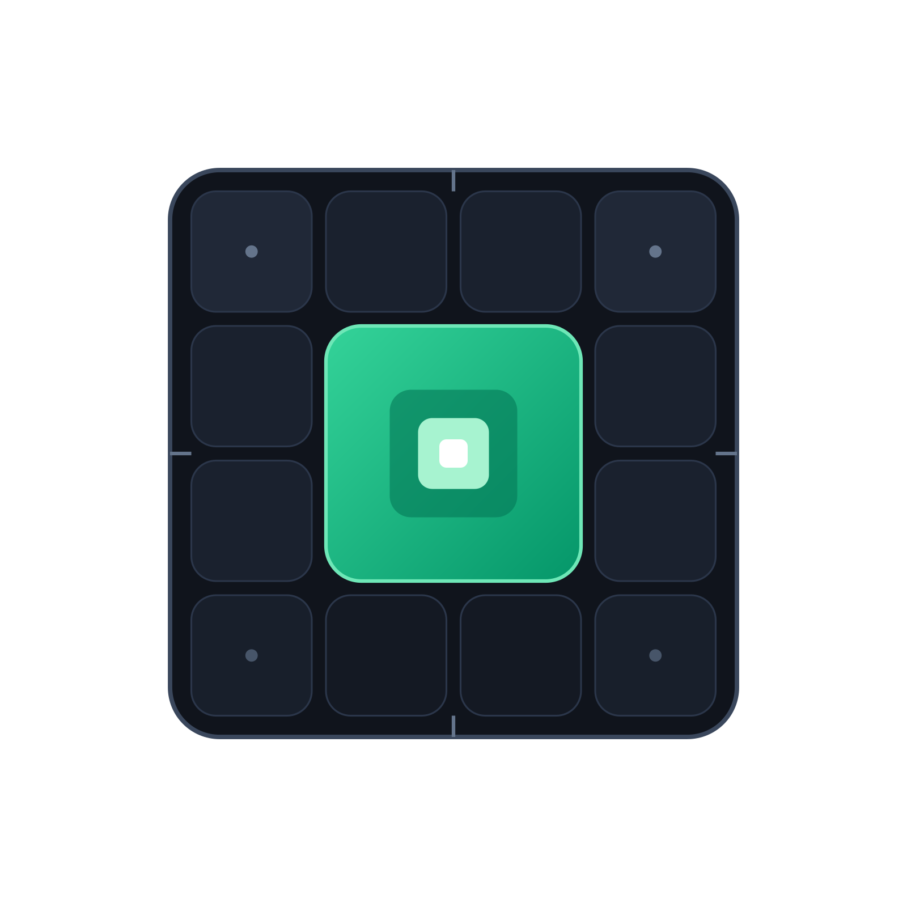

<p align="center">
  
</p>

# Keep Vanilla

Modpack de optimización profunda, estabilidad de *frame time* y eficiencia de recursos para **Minecraft 26.2** sobre **Fabric Loader**.

Construido bajo un principio claro: **máxima optimización técnica sin alterar las mecánicas base de Minecraft, dejando el control visual y la personalización gráfica en manos del usuario.**

---

## Filosofía de Keep Vanilla

El objetivo central del modpack es exprimir al máximo el rendimiento del juego —tasas altas de FPS, estabilidad en el tiempo de cuadro (*frame time*), tiempos de carga reducidos y eliminación de micro-tirones (*stuttering*)— manteniendo intacta la experiencia y la jugabilidad de Minecraft Vanilla:

- **Mecánicas 100 % Vanilla:** Sin añadir contenido ajeno ni alterar físicas, sistemas de redstone, colisiones, spawning de criaturas ni mecánicas del juego base.
- **Optimización integral del motor:** Sodium, Lithium, ImmediatelyFast, FerriteCore y Entity Culling rediseñan el renderizado, el consumo de memoria Heap y la lógica en CPU de manera limpia y eficiente.
- **Libertad total de configuración:** El modpack integra herramientas para que cada jugador configure libremente su balance entre calidad visual y rendimiento. Ya sea que busques exprimir hasta el último fotograma en hardware modesto o disfrutar de shaders complejos en equipos potentes, la decisión sobre partículas, animaciones, niebla o distancia de renderizado es siempre tuya.

---

## Configuración Predeterminada de Alto Rendimiento

*Keep Vanilla* incluye una configuración predeterminada equilibrada desde el primer inicio, diseñada para ofrecer la máxima estabilidad y suavidad sin deteriorar los gráficos:

- **Distancia de Renderizado (12 chunks):** Horizonte amplio y natural (~441 chunks cargados) reduciendo en más del 60 % la carga geométrica en GPU frente a distancias excesivas (20-24 chunks).
- **Distancia de Simulación (10 chunks):** Mantiene la esfera de *spawning* y comportamiento de entidades idéntica a Vanilla (128 bloques / 8 chunks), garantizando el funcionamiento exacto de granjas y circuitos de redstone con una reducción del 30 % en tiempo de tick de CPU.
- **Pipeline de Terreno y Chunks:** Generación multihilo adaptada a la CPU (`chunkBuilderThreads: 0`), aplazamiento suave de mallas (`chunkBuildDeferMode: ALWAYS`) para eliminar micro-tirones al romper/colocar bloques, y oclusión de caras internas y fluidos ocultos.
- **Fidelidad Gráfica Intacta:** Gráficos en modo detallado (*Fancy*), iluminación suave máxima (*Ambient Occlusion*), todas las partículas y animaciones de fluidos activas, y distancia de entidades al 100 %.

---

## Stack de Componentes

El modpack se compone de 17 componentes estrictamente seleccionados y organizados por capas técnicas:

### 1. Renderizado y Gráficos
| Componente | Capa / Área | Función Técnica |
| :--- | :--- | :--- |
| **Sodium** | Renderizado (GPU/CPU) | Motor de renderizado moderno para bloques y terreno |
| **Iris Shaders** | Shaders (GPU) | Pipeline moderno para shaders compatible con Sodium |
| **ImmediatelyFast** | Renderizado (CPU) | Agrupación (*batching*) de llamadas de render para HUD, GUI y entidades |
| **Entity Culling** | Oclusión (CPU Async) | Descarte de entidades ocultas tras muros mediante path-tracing en CPU |

### 2. Configuración Visual y Opciones Avanzadas
| Componente | Capa / Área | Función Técnica |
| :--- | :--- | :--- |
| **Sodium Extra** | Opciones Gráficas | Control granular de partículas, animaciones individuales, niebla, cielo y detalles |
| **Reese's Sodium Options** | Navegación de Menú | Panel vertical con desplazamiento y buscador integrado para las opciones de vídeo |
| **Translations for Sodium** | Localización | Paquete de traducción multiidioma (incluyendo español) para Sodium y sus complementos |

### 3. Lógica, Memoria y Eficiencia de CPU
| Componente | Capa / Área | Función Técnica |
| :--- | :--- | :--- |
| **Lithium** | Lógica y Ticking (CPU) | Optimización de físicas, colisiones, IA y chunk loading sin tocar mecánicas Vanilla |
| **FerriteCore** | Memoria (RAM / GC) | Reducción de huella en memoria para modelos y estados de bloques en el Heap |
| **ModernFix (mVUS)** | Rendimiento y Memoria | Aceleración de arranque, reducción de uso de RAM y corrección de fugas de memoria |
| **BadOptimizations** | Tick de Cliente | Micro-optimizaciones: bypass de recálculo de lightmap y optimización de color del cielo |
| **Dynamic FPS** | Consumo energético | Reduce el consumo de CPU/GPU cuando el juego está en segundo plano |

### 4. Red y Conectividad
| Componente | Capa / Área | Función Técnica |
| :--- | :--- | :--- |
| **Krypton** | Red (Netty) | Optimización de la pila de red y serialización eficiente de buffers de paquetes |

### 5. Base e Interfaz
| Componente | Capa / Área | Función Técnica |
| :--- | :--- | :--- |
| **Fabric API** | Base | API de interoperabilidad esencial para el ecosistema Fabric |
| **Mod Menu** | Interfaz | Menú dentro del juego para consultar y configurar mods |
| **Cloth Config API** | Librería de UI | Motor de pantallas de configuración requerido por mods del stack |
| **Placeholder API** | Librería de texto | Utilidad para formateo de cadenas usada por complementos de UI |

---

## Instalación

### Opción 1: Directa desde tu Launcher (Recomendada)
1. Abre **Prism Launcher**, **Modrinth App**, **PineconeMC** o **ATLauncher**.
2. Pulsa en **Añadir Instancia** y busca `Keep Vanilla`.
3. Selecciona la versión deseada e inicia el juego.

### Opción 2: Importar archivo `.mrpack`
1. Descarga el archivo `.mrpack` desde [Releases](https://github.com/cesarcamiloig/keep-vanilla/releases) o desde [Modrinth](https://modrinth.com/modpack/keep-vanilla).
2. En tu launcher, pulsa en **Añadir Instancia -> Importar** y selecciona el archivo `.mrpack`.
3. Inicia la instancia. Todas las dependencias se descargan y verifican automáticamente contra los hashes oficiales.

---

## Desarrollo y Mantenimiento

Este proyecto utiliza [Packwiz](https://packwiz.infra.link/) para la gestión reproducible del modpack sin almacenar binarios `.jar` en el repositorio Git.

### Entorno aislado con Docker
El proyecto incluye un `Dockerfile` multi-stage ligero basado en Alpine Linux para ejecutar Packwiz de forma aislada sin requerir Go en la máquina anfitriona.

1. Construir la imagen local (solo la primera vez):
```powershell
docker build -t packwiz-cli .
```

2. Definir el alias de conveniencia en PowerShell:
```powershell
function pw { docker run --rm -it -v "${PWD}:/workspace" packwiz-cli $args }
```

3. Comandos útiles:
```powershell
# Actualizar el índice tras modificar archivos
pw refresh

# Exportar paquete en formato Modrinth (.mrpack)
pw modrinth export

# Comprobar actualizaciones de dependencias
pw update --all
```

Las políticas técnicas de actualización y versionado están documentadas en [POLITICA_VERSIONES.md](POLITICA_VERSIONES.md).
